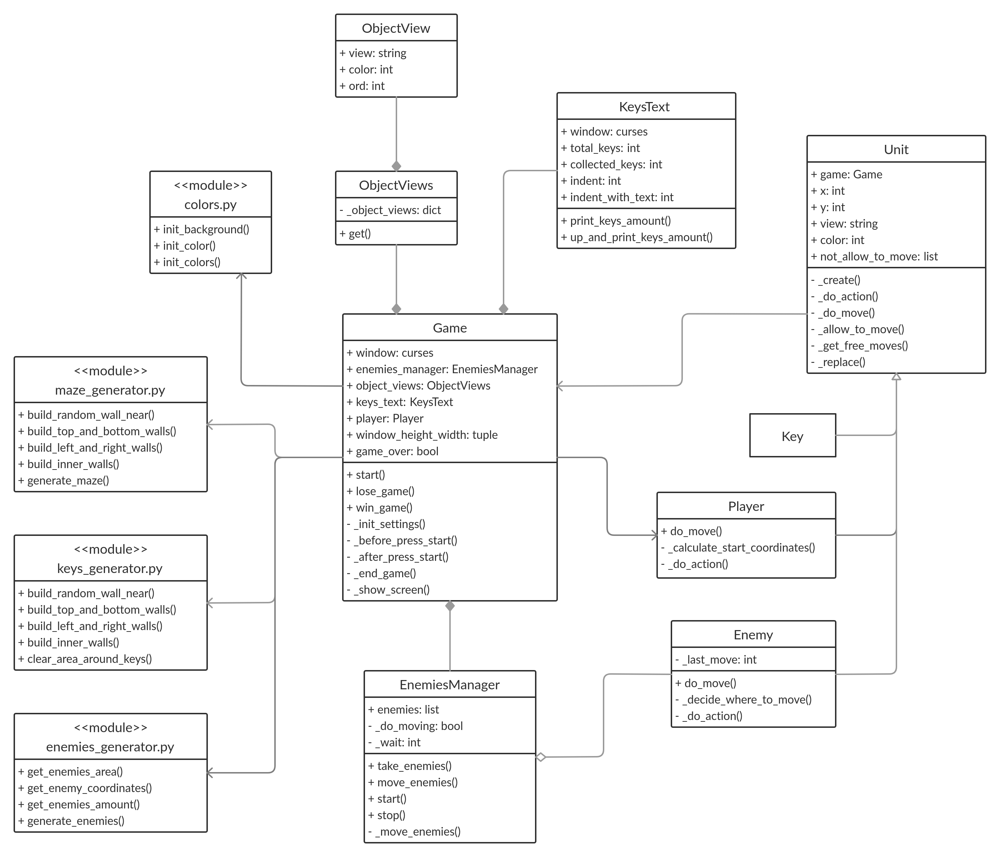
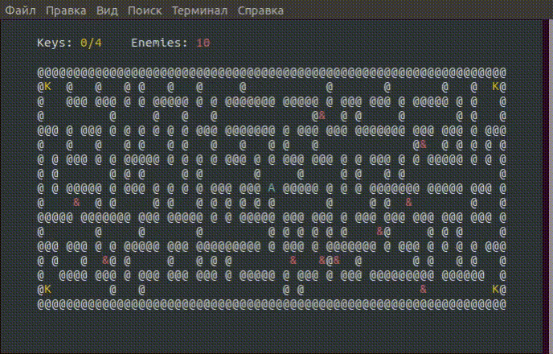
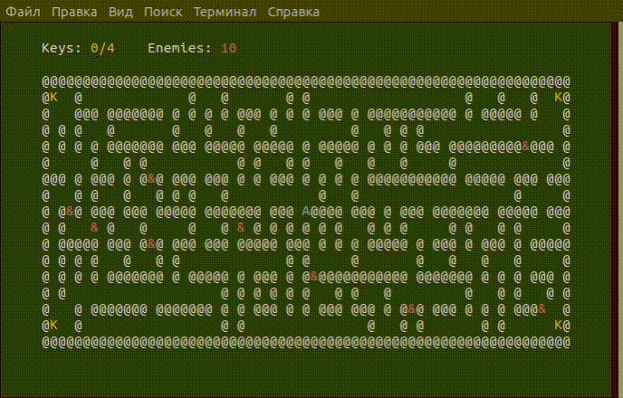
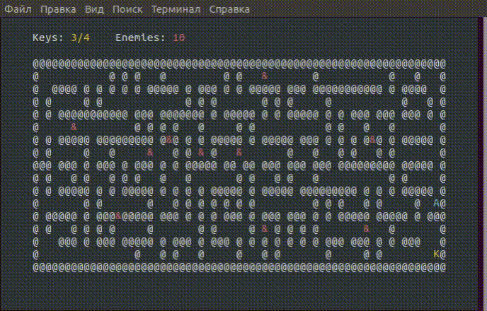
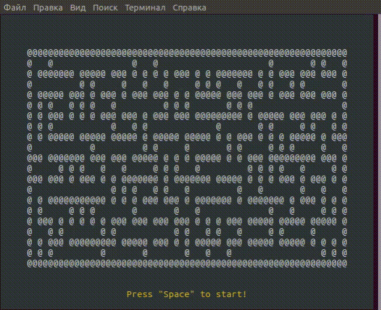
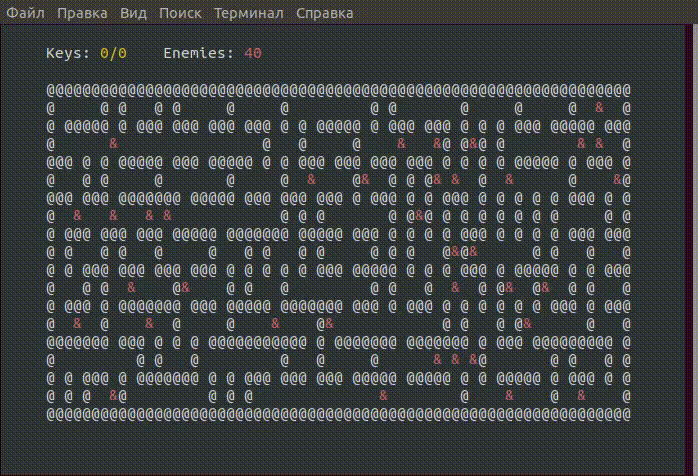
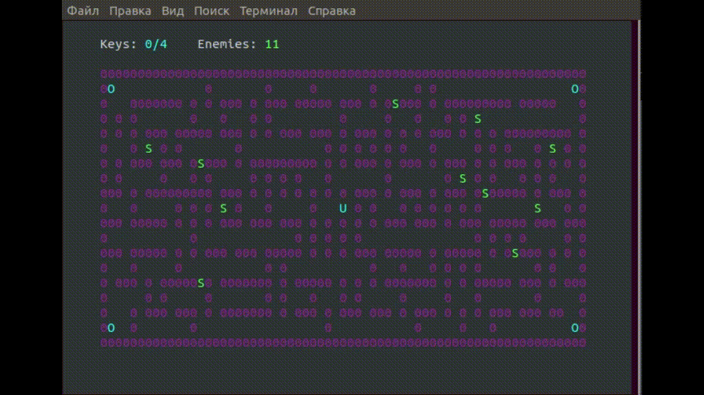

# Escape from maze

**Escape from maze** is my pet project console game. 

### Project schema



### Description
Player appears in random generated maze. 
The win condition is collect four keys. But it is not that simple, there are some enemies in maze 
which you should avoid.



If you lose



If you win




### Maze generation
Before the game start, there is a possibility to choose a size of maze. 
If you change the size, the structure of maze will change too.



### Enemies
Player moves in the main thread, but enemies moving is in another thread. 
**EnemiesManager** manages moving of every enemy. 
Also there is a possibility to change enemies amount and theirs speed.




### Objects appearance
Object appearance consists of char and color, and both may be changed.




### Play
The command to start game
```shell script
$ python start.py
```